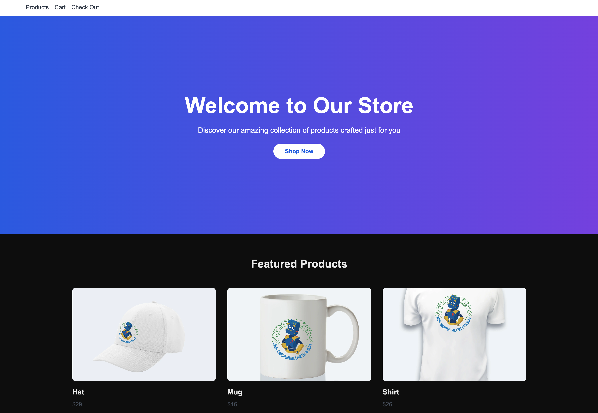

# Next.js E-commerce Platform

A modern, full-stack e-commerce application built with Next.js 14, MongoDB, and TypeScript. This project demonstrates best practices in web development, state management, and API integration.



## 🚀 Technical Stack

### Frontend
- **Next.js 14** - Utilizing the latest App Router and Server Components
- **TypeScript** - For type-safe code and better developer experience
- **Tailwind CSS** - For responsive and modern UI design
- **Server Components** - Optimizing performance through server-side rendering
- **Client Components** - For interactive UI elements

### Backend
- **MongoDB** - NoSQL database for flexible data storage
- **Next.js API Routes** - RESTful API endpoints
- **Server-side Data Fetching** - Optimized data loading patterns

## ✨ Key Features

- **Dynamic Product Catalog**
  - Server-side rendered product listings
  - Dynamic routing for product details
  - Responsive image optimization

- **Shopping Cart System**
  - Real-time cart updates
  - Persistent cart storage
  - MongoDB integration for cart management

- **User Experience**
  - Responsive design for all devices
  - Fast page transitions
  - Optimized image loading
  - Error handling and loading states

## 🛠 Technical Implementation

### API Routes
```typescript
// Example of API route with MongoDB integration
export async function GET(request: NextRequest) {
  const { db } = await connectToDb();
  const products = await db.collection('products').find({}).toArray();
  return new Response(JSON.stringify(products), {
    status: 200,
    headers: { 'Content-Type': 'application/json' }
  });
}
```

### Database Integration
- Custom MongoDB connection handling
- Efficient data querying
- Type-safe database operations

### Performance Optimizations
- Server-side rendering for faster initial page loads
- Image optimization using Next.js Image component
- Efficient data caching strategies

## 📈 Architecture Highlights

### Data Flow
