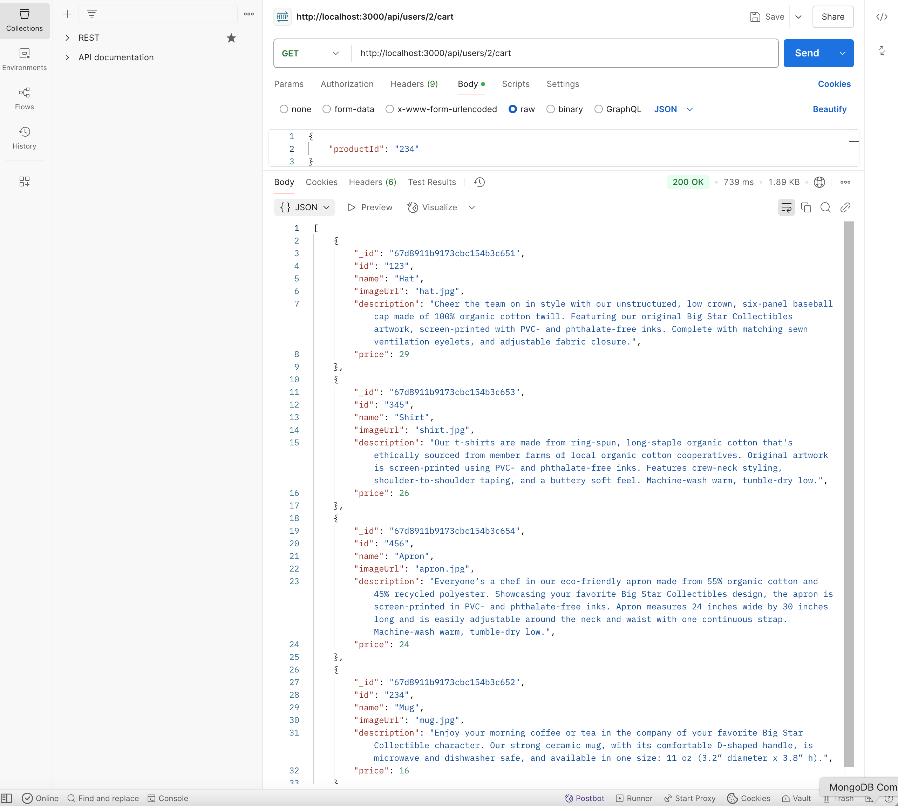

# Next.js E-commerce Platform

A modern, full-stack e-commerce application built with Next.js 14, MongoDB, and TypeScript. This project demonstrates best practices in web development, state management, and API integration.

# MERN Stack E-commerce Platform

<div align="center">
  <h2>📱 Application Screenshots</h2>
</div>

<div align="center">
  <!-- Main Homepage -->
  
</div>

<div align="center">
  <!-- Product Features Grid -->
  <div style="display: grid; grid-template-columns: repeat(2, 1fr); gap: 20px; margin-bottom: 20px;">
    
    
    
  </div>
</div>

<div align="center">
  <details>
    <summary><strong>View More Screenshots</strong></summary>
    <br>
    <!-- Additional Features -->
    
    
  </details>
</div>

## 🚀 Key Features Demonstrated in Screenshots
- **Homepage**: Modern UI with featured products and hero section
- **Product List**: Responsive grid layout with product cards
- **Product Detail**: Detailed view with product information
- **Shopping Cart**: Interactive cart management
- **Mobile View**: Responsive design for mobile devices
- **API Integration**: RESTful API endpoints
- **Database**: MongoDB data structure and relationships

## 🚀 Technical Stack

### Frontend
- **Next.js 14** - Utilizing the latest App Router and Server Components
- **TypeScript** - For type-safe code and better developer experience
- **Tailwind CSS** - For responsive and modern UI design
- **Server Components** - Optimizing performance through server-side rendering
- **Client Components** - For interactive UI elements

### Backend
- **MongoDB** - NoSQL database for flexible data storage
- **Next.js API Routes** - RESTful API endpoints
- **Server-side Data Fetching** - Optimized data loading patterns

## ✨ Key Features

- **Dynamic Product Catalog**
  - Server-side rendered product listings
  - Dynamic routing for product details
  - Responsive image optimization

- **Shopping Cart System**
  - Real-time cart updates
  - Persistent cart storage
  - MongoDB integration for cart management

- **User Experience**
  - Responsive design for all devices
  - Fast page transitions
  - Optimized image loading
  - Error handling and loading states

## 🛠 Technical Implementation

### API Routes
```typescript
// Example of API route with MongoDB integration
export async function GET(request: NextRequest) {
  const { db } = await connectToDb();
  const products = await db.collection('products').find({}).toArray();
  return new Response(JSON.stringify(products), {
    status: 200,
    headers: { 'Content-Type': 'application/json' }
  });
}
```

### Database Integration
- Custom MongoDB connection handling
- Efficient data querying
- Type-safe database operations

### Performance Optimizations
- Server-side rendering for faster initial page loads
- Image optimization using Next.js Image component
- Efficient data caching strategies

## 📈 Architecture Highlights

### Data Flow
<div align="center">
  <!-- Product Features Grid -->
  <div style="display: grid; grid-template-columns: repeat(2, 1fr); gap: 20px; margin-bottom: 20px;">
    
  </div>
</div>